# IEEE-754 Decimal-64 Converter

## Overview 
- This repository contains a Decimal to IEEE-754 Decimal-64 floating-point converter, developed as a course requirement for CSARCH2 (Computer Architecture) at De La Salle University - Manila. The converter is designed to handle large numbers with more than 16 digits, supporting special cases like *NaN*. It outputs results in binary and hexadecimal forms, with an option to save the results to a text file.

## Features
- **Input**: Accepts decimal numbers in base-10 format, supporting more than 16 digits. Users can choose their preferred rounding method.
- **Special Cases**: Handles special cases such as *NaN* seamlessly.
- **Output Formats**: 
    1. Binary output with space between sections.
    2. Hexadecimal equivalent.
    3. Option to output results to a text file.

## Usage
### Online 
- accessible at this link: https://kylecarlo.github.io/IEEE-Dec64-Converter/
### Local
- download the repository (zip)
- extract the zip file
- run a server
    - if using VScode, install the extension **Live Server** *(by Ritwick Dey)*
    - open the directory where the *index.html* is located
    - run the server

## Test Cases
### Normal Cases
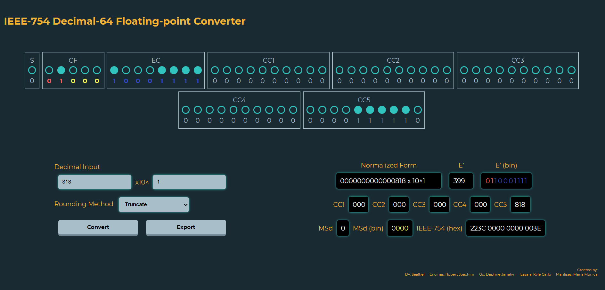
#### with different rounding algorithms
- truncate positive input
    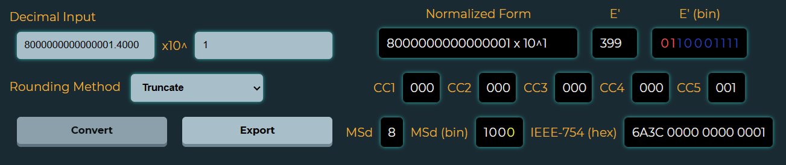
- truncate negative input
    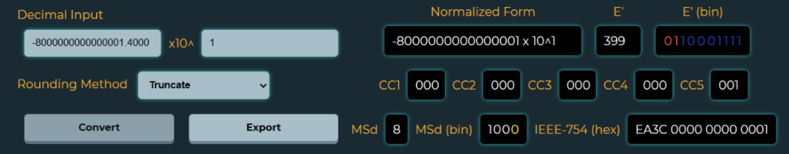
- ceil positive input
    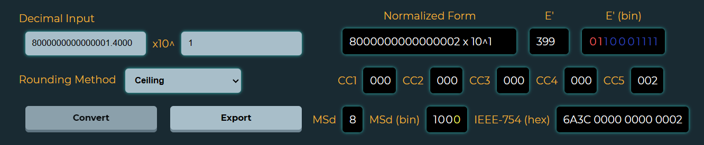
- ceil negative input
    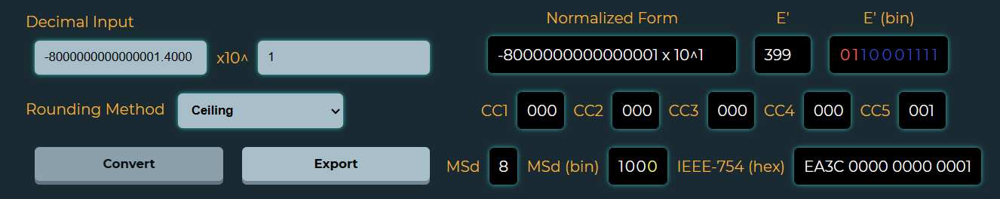
- floor positive input
    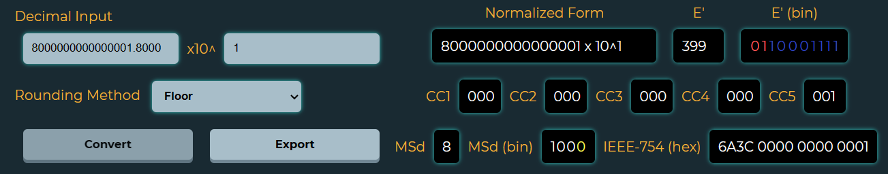
- floor negative input
    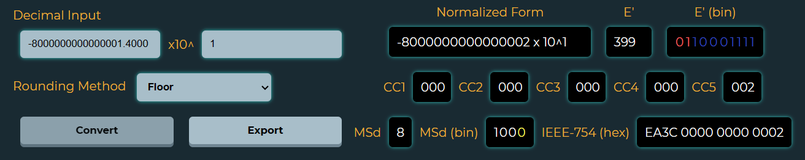
- round to nearest, ties to even of positive input
    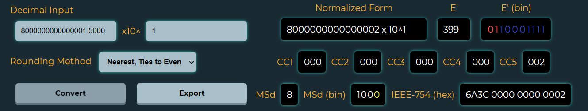
- round to nearest, ties to even of negative input
    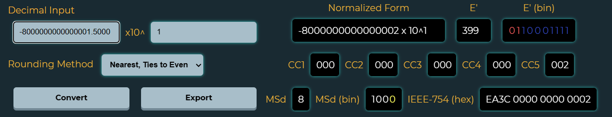
### Special Cases
#### Infinity
- Positive Infinity (exponent too large; ***e > 384***)
    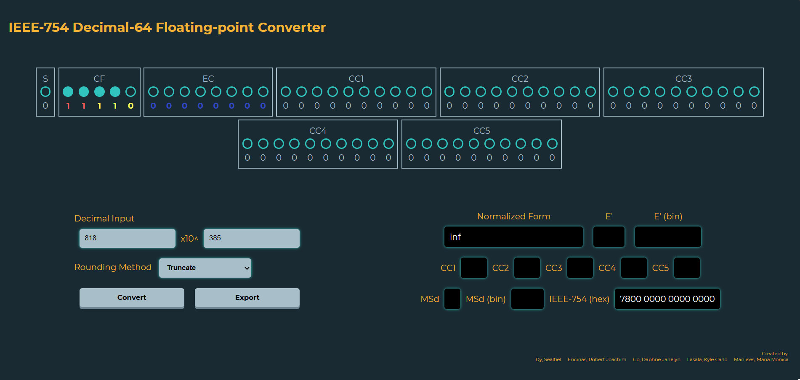
- Negative Infinity (exponent too small; ***e < -398***)
    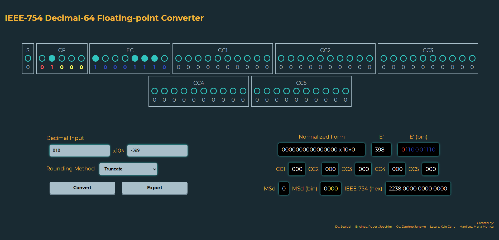
#### Not A Number (***NaN***)
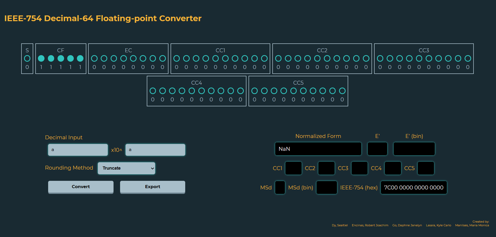

## Demo
https://github.com/KyleCarlo/IEEE-Dec64-Converter/assets/90784458/018ba79f-373a-4981-a4b0-1060bb30cb89

## Authors
- Sealtiel Dy (sealtiel_dy@dlsu.edu.ph)
- Robert Joachim Encinas (robert_joachim_encinas@dlsu.edu.ph)
- Daphne Janelyn Go (daphne_janelyn_go@dlsu.edu.ph)
- Kyle Carlo Lasala (kyle_lasala@dlsu.edu.ph)
- Maria Monica Manlises (maria_monica_manlises@dlsu.edu.ph)
